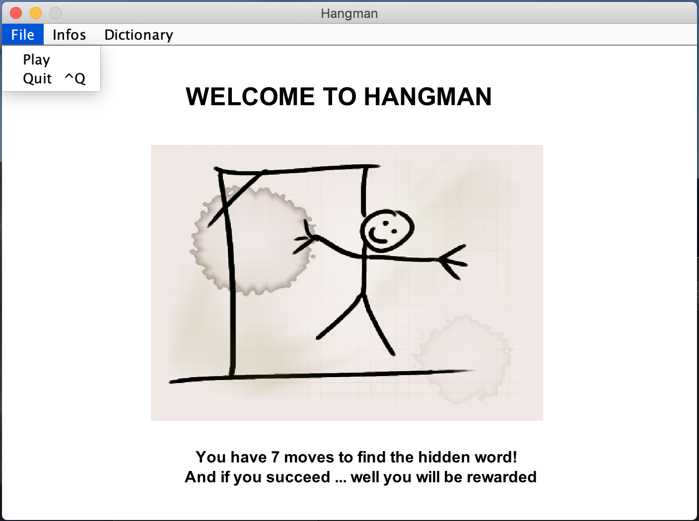
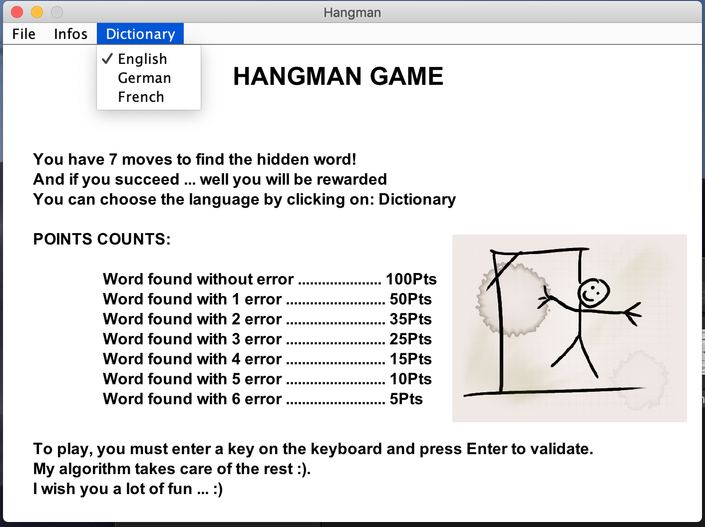

= Hangman

This game was developed in Java with the IDE Eclipce.

== How to run the application?

* In the IDE: find `Main.java`, right-click project, select "Run As > Java Application"
* From the command line: run `java -jar hangman.jar`
* Make sure that the "files" folder containing the dictionary files is in the main directory (in case you have used the command line)

